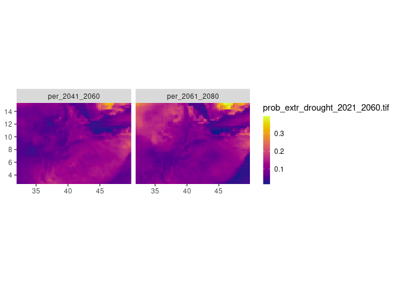

# Ethiopia Climate Modeling Analysis

## Project Description:

This project analyzes the probability of extreme drought across Ethiopia
using climate models. The focus period is from 2041 to 2080, this
project is meant to provide insights into Ethiopia’s climate
vulnerabilities.

``` r
# Load Libraries
library(tidyverse)
```

    ── Attaching core tidyverse packages ──────────────────────── tidyverse 2.0.0 ──
    ✔ dplyr     1.1.2     ✔ readr     2.1.4
    ✔ forcats   1.0.0     ✔ stringr   1.5.0
    ✔ ggplot2   3.4.2     ✔ tibble    3.2.1
    ✔ lubridate 1.9.2     ✔ tidyr     1.3.0
    ✔ purrr     1.0.1     
    ── Conflicts ────────────────────────────────────────── tidyverse_conflicts() ──
    ✖ dplyr::filter() masks stats::filter()
    ✖ dplyr::lag()    masks stats::lag()
    ℹ Use the conflicted package (<http://conflicted.r-lib.org/>) to force all conflicts to become errors

``` r
library(stars)
```

    Loading required package: abind
    Loading required package: sf
    Linking to GEOS 3.10.2, GDAL 3.4.3, PROJ 8.2.0; sf_use_s2() is TRUE

``` r
# Load Data
s_ensmean <- read_stars("/mnt/pers_disk/ethiopia_drought/prob_extr_drought_2021_2060.tif")

# Visualize Ensemble Mean Probabilities of Extreme Drought
s_ensmean %>% 
  as_tibble() %>% 
  ggplot() +
  geom_raster(aes(x, y, fill = prob_extr_drought_2021_2060.tif)) +
  colorspace::scale_fill_continuous_sequential("plasma",
                                               na.value = "transparent",
                                               # breaks = c(0, 0.1, seq(0.15, 0.35, 0.05)),
                                               rev = F,
                                               guide = guide_colorbar(barwidth = 0.6)) +
  # geom_sf(data = aggr_pol, fill = "white", alpha = 0.2, color = "grey10") +
  
  coord_sf(expand = F) +
  facet_wrap(~band, ncol = 2) +
  theme(axis.title = element_blank())
```


