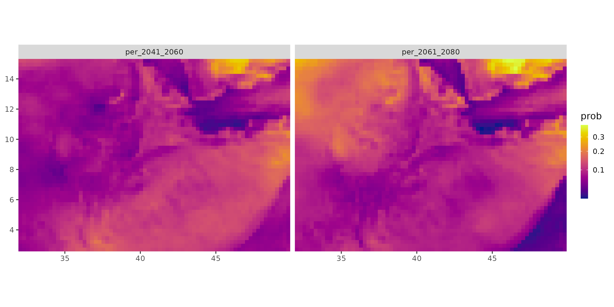

# Ethiopia Climate Modeling Analysis

## Project Description:

This project analyzes the probability of extreme drought across Ethiopia
using climate models. The focus period is from 2041 to 2080, this
project is meant to provide insights into Ethiopia’s climate
vulnerabilities.

